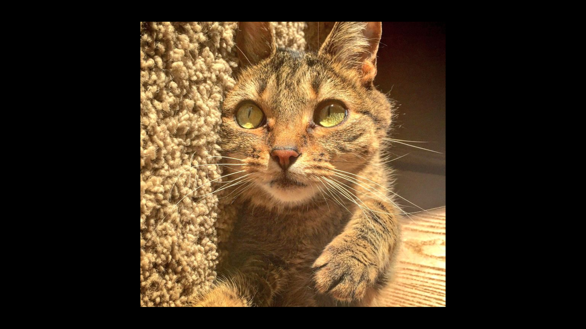

# 🐱 Catwalk

A tiny fullscreen cat slideshow written in Python.

Catwalk downloads random cat images from [CATAAS](https://cataas.com/) and displays them as a fullscreen slideshow. The project started as a small shell script using `curl` and `feh`, then evolved into a cross-platform Python application.

## Features

- 🐈 Random cat images
- 🖥️ Fullscreen display
- 🖱️ Hidden mouse cursor
- ⏱️ Configurable slideshow delay
- 🔄 Background image downloading
- 📦 Small and self-contained
- 🐧 Linux and 🪟 Windows compatible

## Preview



## Demo


## Download

Prebuilt binaries are available here:

- 🪟 Windows: [Catwalk.exe](https://github.com/entreman/catwalk/releases/latest/download/Catwalk.exe)
- 🐧 Linux: [catwalk](https://github.com/entreman/catwalk/releases/latest/download/catwalk)

## Installation

### Clone the repository:

```bash
git clone https://github.com/entreman/catwalk.git
cd catwalk
```


### Create a virtual environment:

```bash
python -m venv .venv
```


### Activate it:

#### Linux
```bash
source .venv/bin/activate
```
#### Windows
```bat
.venv\Scripts\activate
```

### Install dependencies:

```
pip install -r requirements.txt
```

## Usage

### Start Catwalk:
```
python ./src/catwalk.py
```

### Default delay:
3 seconds per image

### Set a custom delay:

Example:
```
python ./src/catwalk.py 10
```
will show a new cat every 10 seconds.

## Controls
| Key   | Action               |
| ----- | -------------------- |
| `ESC` | Exit fullscreen mode |


## How it works

Catwalk uses a simple producer-consumer design:

          +----------------+
          |  CATAAS API    |
          +-------+--------+
                  |
                  v
          +----------------+
          | Downloader     |
          | (background)   |
          +-------+--------+
                  |
                  v
          +----------------+
          | Queue (10 cats)|
          +-------+--------+
                  |
                  v
          +----------------+
          | Fullscreen GUI |
          +----------------+

The downloader fetches images in the background while the viewer displays them. A queue keeps the two parts independent and prevents the display from blocking on network requests.

## Dependencies
- Python 3
- Pillow
- Requests
- Tkinter (usually included with Python)

Install with:
```
pip install -r requirements.txt
```

## Building a standalone executable

Install PyInstaller:
```
pip install pyinstaller
```

Build:

**Linux**
```
pyinstaller \
  --onefile \
  --hidden-import=PIL._tkinter_finder \
  src/catwalk.py
```

**Windows**
```
pyinstaller --onefile --hidden-import=PIL._tkinter_finder --windowed --name=Catwalk src\catwalk.py
```

The executable will be created in:
```
dist/
```

Build separately on each target platform:

- Linux → Linux executable
- Windows → .exe


## License

Feel free to use, modify, and share this project.

---

Made with Python, curiosity, and an unreasonable amount of cats. 🐈


## Mentions
- Schwarz Katze Icon by Chanut is Industries on <a href="https://icon-icons.com/de/authors/283-chanut-is-industries">Icon-Icons.com</a>
